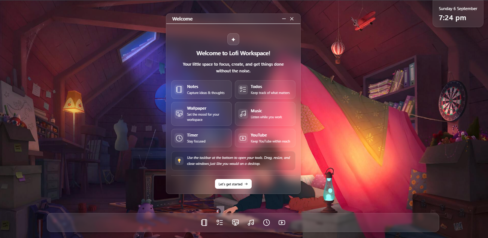
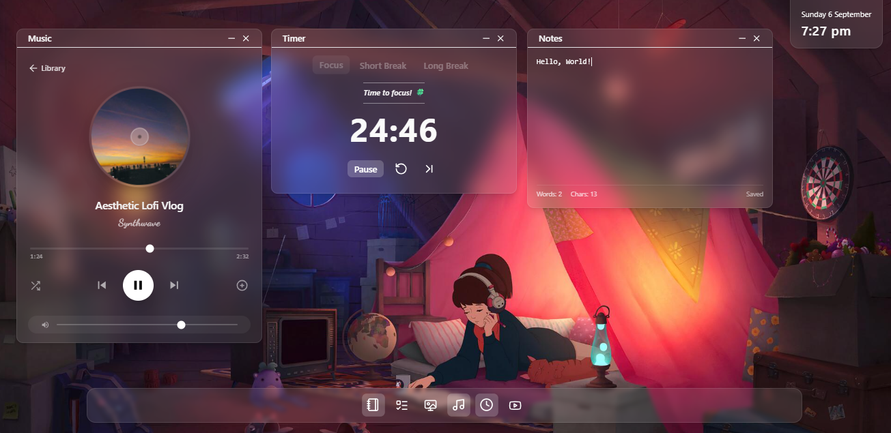
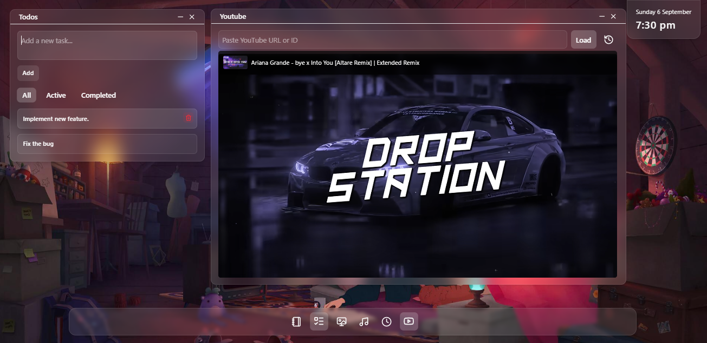
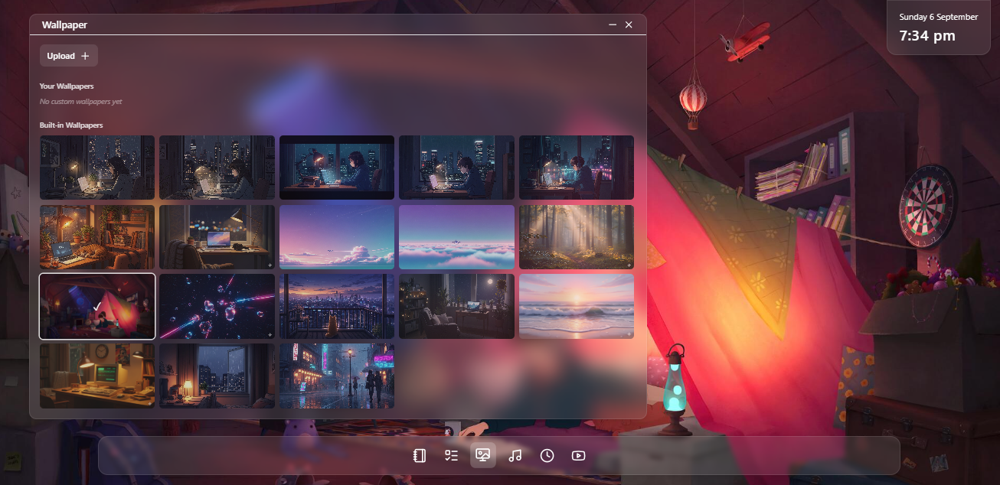

# Lofi Workspace

An aesthetic productivity workspace built with React and Tailwind CSS. Lofi Workspace brings several everyday productivity tools together into a calm and single desktop-inspired interface, designed to provide a focused and relaxing environment for work and study.


## 🌐 Live Demo

[View Lofi Workspace](https://lofi-workspace-app.vercel.app/)

## Overview

Lofi Workspace is a browser-based virtual workspace inspired by desktop operating systems and minimalist productivity environments.

Instead of switching between multiple applications, users can access useful tools such as notes, music, timers, tasks, wallpapers, and media in one unified workspace.

The project focuses on creating a **functional, interactive, and visually polished frontend experience** while demonstrating modern React development patterns.

## 🚀 Features

- 📝 **Notes** — Capture and manage ideas quickly inside the workspace.
- ☑️ **Todos** — Keep track of tasks and priorities.
- 🖼️ **Wallpapers** — Customize your workspace with different wallpapers.
- 🎵 **Music Player** — Listen to music while working or studying.
- ⏱️ **Timer** — Built-in timer for focused work sessions.
- ▶️ **Mini YouTube Player** — Watch YouTube content without leaving the workspace.
- 🪟 **Draggable Windows** — Open tools inside movable desktop-style windows.
- 📐 **Resizable Windows** — Resize workspace windows according to your preference.
- 📌 **Window Management** — Open, close, minimize, and manage multiple tools.
- 🖥️ **Desktop-style Taskbar** — Quickly access workspace applications and controls.
- 💾 **Local Persistence** — User data such as notes, todos, and preferences can persist locally.
- 📱 **Responsive UI** — Designed to provide a consistent experience across different screen sizes..

## 🛠️ Tech Stack

### Frontend

* **React**
* **JavaScript (ES6+)**
* **Tailwind CSS**
* **Vite**

### State Management

* **Redux Toolkit**

### Browser APIs & Storage

* **LocalStorage**
* **IndexedDB**

### Other Technologies

* **YouTube Embed API / iframe**
* Modern CSS
* Responsive design principles

## 🏗️ Architecture

The application follows a component-based React architecture with reusable UI components and centralized state management.

Key architectural concepts include:

* Reusable window components
* Redux-based application state
* Custom React hooks for window interactions
* Separation of UI components and application logic
* Local browser storage for persistence
* Modular feature-based components

This structure makes the project easier to maintain and provides a foundation for adding additional workspace applications in the future.

## 📂 Project Structure

```text
src/
├── assets/
├── components/
│   ├── taskbar/
│   ├── timer/
│   ├── window/
│   └── ...
├── features/
│   ├── windows/
|   |   └── windowSlice.js/
│   ├── music/
|   |   └── musicSlice.js/
│   └── ...
├── hooks/
├── store/
│   └── store.js
├── App.jsx
└── main.jsx

public/
├── bg-images/
├── songs/
└── ...
```

> The exact structure may evolve as new features are added.

## ⚙️ Getting Started

### Prerequisites

Make sure you have the following installed:

* Node.js
* npm

### Installation

Clone the repository:

```bash
git clone https://github.com/Its-SaAdi/lofi-workspace-app
cd lofi-workspace-app
npm install
npm run dev
```

## 🎯 Project Goals

The primary goals of Lofi Workspace are to:

* Build a visually engaging React application.
* Practice advanced component-based UI development.
* Implement interactive desktop-style window management.
* Work with centralized state management using Redux Toolkit.
* Explore browser storage technologies such as LocalStorage and IndexedDB.
* Create reusable and maintainable frontend architecture.
* Combine functionality and aesthetics into a practical productivity application.

## 🔮 Future Improvements

Potential improvements and features include:

* [ ] User accounts and cloud synchronization
* [ ] Additional productivity applications
* [ ] More advanced task management
* [ ] Workspace customization
* [ ] Theme customization
* [ ] Keyboard shortcuts
* [ ] Mobile-specific workspace experience
* [ ] Cloud-based music library
* [ ] Improved accessibility

## 📸 Screenshots

Screenshots and demonstrations of the application can be added here.

### Main Workspace



### Tools



### YouTube & Todos



### Customize workspace background


```

## 🤝 Contributing

Contributions, suggestions, and improvements are welcome.

If you'd like to contribute:

1. Fork the repository.
2. Create a new branch.
3. Make your changes.
4. Commit your changes.
5. Open a pull request.

## 📄 License

This project is currently available for personal and educational purposes.

**Built with React, Tailwind CSS, and a little bit of lofi. 🎧**